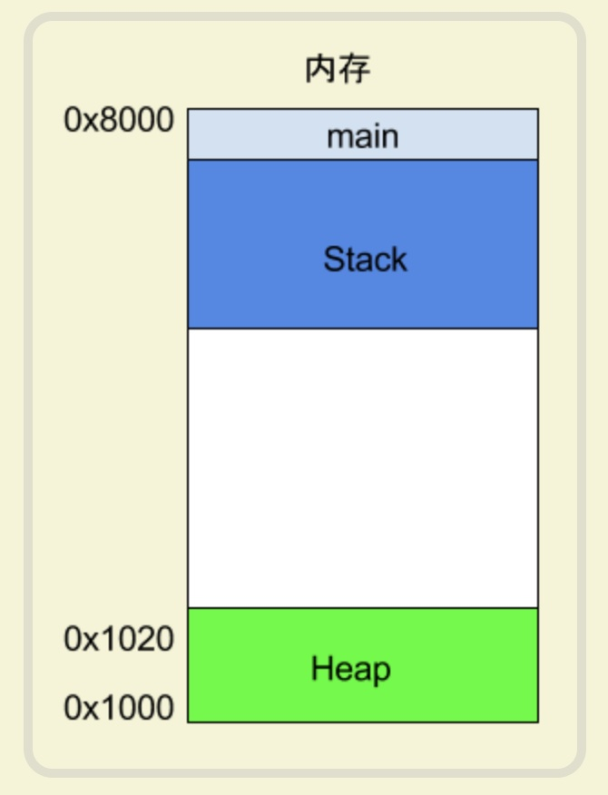

[TOC]

## 汇编语言入门笔记

### 1. 寄存器

> CPU只负责**运算**，不负责数据的**存储**数据，数据一般是存在内存当中。但是cpu的运算远远大于内存数据的读取速度，为了提高效率，cpu设置了一级缓存和二级缓存。基本上，cpu缓存可以看做是读写速度比较快的内存
>
> 但是缓存的速度还是不够快，另外数据在缓存中的存储地址也是不固定的，cpu寻址也会拖慢速度。因此，除了cpu缓存以外，cpu还自带了寄存器(register)，用于存储最常用的数据（比如循环变量），cpu会优先读取寄存器，再由寄存器和内存交换内容。寄存器是**按照名字来划分的**，直接告诉cpu去哪里拿数据，速度很快

###  2. 内存模型

 #### 2.1. heap 堆

> 寄存器存储的内容很少，很多时候，cpu都是指挥寄存器和内存交换数据的
>
> 在程序运行的时候，对于**用户的动态、主动内存申请**，系统会从预先分配好的内存中划取一部分给用户，从**低位**到**高位**
>
> 需要注意的是：heap的一个重要特点是不会自动消失，必须手动释放或者由垃圾回收机制来收回
>
> 

#### 2.4. stack 栈

> 除了heap以外，其他的内存占用都叫做stack(栈)。简单来说，stack是由于函数运行而临时占用的内存块 **高位**到**低位**
>
> 

---------

> 考虑一个函数

```go
func main() {
  var a int
  var b int
}
```

> 系统开始执行main时，会在stack中建立一个frame（帧），所有main的内部变量（比如a和b）都会保存在frame中，当main执行完毕后，这个帧就会被回收，释放所有的内部变量，不再占有资源
>
> 

----

> 如果函数调用了内部函数

```go
func main() int {
  var a int
  var b int
  a = 1
  b = 2
  ret := add_a_and_b(a, b)
	fmt.Println(ret)
}

func add_a_and_b(a, b int) int {
  ret := a + b
  return ret
}
```

>在main执行到add_a_and_b的时候，系统也会为该函数创建一个帧，用来存储它的内部变量。也就是说，这是同时存在两个帧：main和add_a_and_b。一般来说，调用栈有多少层，就有多少帧
>
>
>
>等到add_a_and_b调用完毕后，它的帧就会被回收。系统会回到main刚才中断的地方，继续往下执行。通过这种方式，实现了函数的层层调用，并且每一层都能使用自己的内部变量
>
>所有的帧都存放在栈中，生成新的帧，叫做“入栈”，push
>
>帧的回收叫做“出栈”，pop
>
>栈是一种**先进后出**的数据结构，每一次函数执行结束，就释放一个帧。当所有的函数执行完后，栈也就释放掉了
>
>
>
>

### 3. cpu指令

> 将上面的代码编译成汇编码

```sh
go build -gcflags -S asm.go
```

